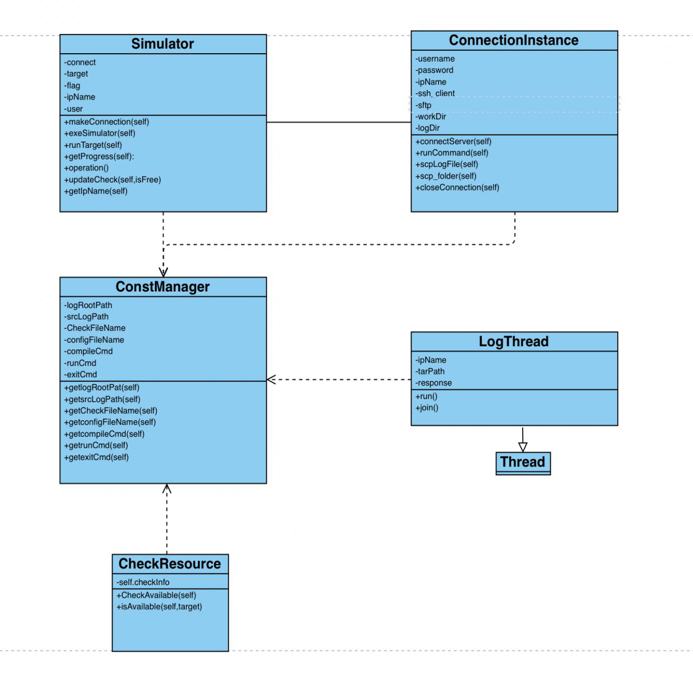

# IRP
### trigger the fracture growth simulator in remote servers and monitor the progress of simulation on all machines

## install and dependencies
### back-end install
#### dependencies
Language: Python 3.8
```
pip install -r requirements.txt
```
#### mounting the server
```
flask run
```
#### configuration your own commands to compile and run C++ code in the server
editing the const variables in the file below
```
getConst.py
```

### front-end
Language: JavaScript
dependencies: Bootstrap 5.2
https://getbootstrap.com/docs/5.2/getting-started/download/

## documentation

```
Class ConnectionInstance
```
This class is to make connection to the target server

```
Function: connectServer(self)
input: self.username
input: self.password
input: self.ipName

SSH connect to the target server
```

```
Function: scpLogFile(self)
input: self.workDir
input: self.logDir

scp the log file of simulation
```

```
Function: runCommand(self)

run the simulation program on the server
```